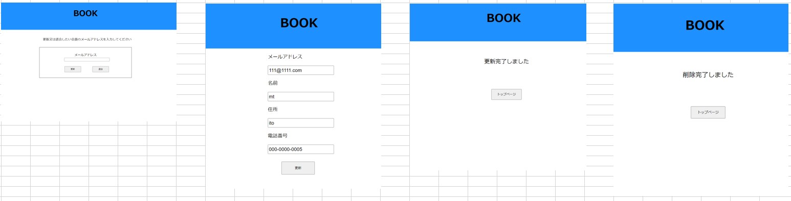

## 会員情報画面
*****

*****
補足：対応DBの列はDB設計後、〇を対応する・カラム名に差し替えること。

| ID | 項目名 | 内容 | アクション | イベント | 対応DB　|
|----|------|-----|-----------|----------|--------|
|1　　|ヘッダー|テキスト画像|クリック|商品一覧画面に遷移|-|
|2   |名前  |varchar(50)|テキスト入力|-         |〇      |
|3   |住所|varchar(50)|テキスト入力|-         |〇      |
|4   |電話番号 |int(10)　ハイフンなし数値のみ|テキスト入力|-         |〇      |
|5   |更新|ボタン|クリック|更新完了画面に遷移|-|

## 更新完了
| ID | 項目名 | 内容 | アクション | イベント | 対応DB　|
|----|------|-----|-----------|----------|--------|
|1　　|ヘッダー|テキスト画像|クリック|商品一覧画面に遷移|-|
|2   |ログイン|ボタン|クリック|ログイン画面に遷移|-|

## 更新失敗
| ID | 項目名 | 内容 | アクション | イベント | 対応DB　|
|----|------|-----|-----------|----------|--------|
|1　　|ヘッダー|テキスト画像|クリック|商品一覧画面に遷移|-|
|2   |トップページ|ボタン|クリック|トップページに遷移|-|
|3   |会員情報|ボタン|クリック|会員情報画面に遷移|-|

